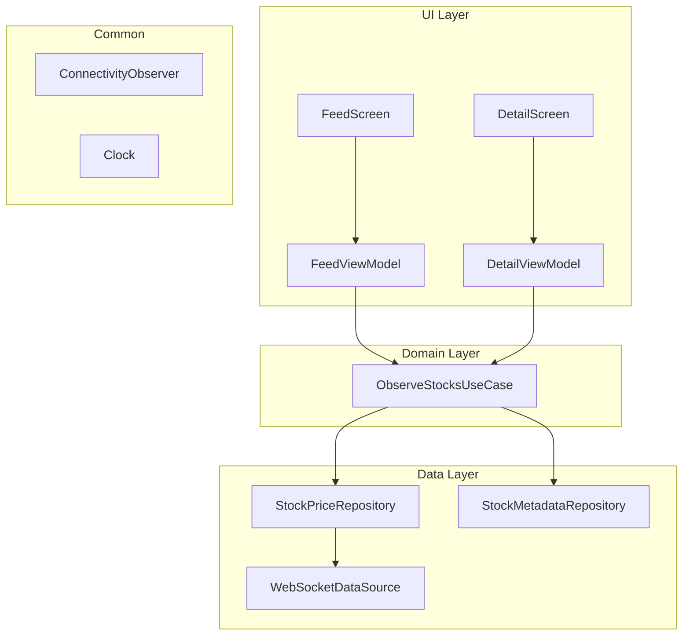

# PriceTracker — Real-Time Stock Price Tracker

A real-time stock price tracker built with Jetpack Compose, WebSocket integration, and MVI-lite architecture. Displays live price updates for 25 stock symbols with a feed screen and symbol detail screen.

## Demo
### Light Mode

https://github.com/user-attachments/assets/9768d448-de1c-4560-8329-74781a6a4ab1 

### Dark Mode

https://github.com/user-attachments/assets/b47df03d-18d2-4ee7-b4c8-71423903cec9

## Requirements Checklist

### Core Features

- [x] **25 stock symbols** in a scrollable LazyColumn
- [x] **WebSocket echo integration** — `wss://ws.postman-echo.com/raw`, batched JSON, updates only on echo receipt
- [x] **Feed screen** — symbol, price, direction indicator (Material Icons), sorted by price descending
- [x] **Top bar** — left: connection indicator (green/red dot + Live/Offline), right: Feed label + Switch
- [x] **Detail screen** — symbol title, company name, large price with indicator, description, deep link URI
- [x] **Row tap** navigates to detail screen

### Technical Expectations

- [x] **100% Jetpack Compose** — no Views, no AndroidView
- [x] **MVI-lite** — single immutable `UiState`, ViewModel functions for user actions, UDF
- [x] **Navigation Compose** with NavHost — type-safe `@Serializable` routes (Navigation 2.8+)
- [x] **Kotlin Flow** — `callbackFlow` for WebSocket, `StateFlow` for state, `SharedFlow` for errors
- [x] **Immutable UI state** — `@Immutable` data classes, `MutableStateFlow.update {}` for atomic mutations
- [x] **ViewModel + StateFlow** — `stateIn(WhileSubscribed(5_000))`, `collectAsStateWithLifecycle()`
- [x] **SavedStateHandle** — Detail ViewModel reads symbol from nav argument
- [x] **Shared WebSocket** — singleton repository, both ViewModels observe same StateFlow

### Bonus

- [x] **Price flash animation** — `Animatable<Color>` + `drawBehind` (draw phase only)
- [x] **62 tests** — 41 local JVM + 21 instrumented, all fakes, no mocking framework
- [x] **Light/dark themes** — Material 3 dynamic color, follows system
- [x] **Deep link** — `stocks://symbol/{symbol}` via type-safe `navDeepLink<Detail>`
- [x] **Structured error handling** — `DataError` → `UiError` mapping with localized strings
- [x] **Connectivity-aware reconnection** — waits for internet before retrying

## Architecture



### Data Flow

```
WebSocket echo → Repository (atomic update) → UseCase (combine + direction) →
ViewModel (sort/filter + map + error) → UiState → Compose
```

### Error Flow

```
Data layer exception → DataError (sealed) → ViewModel.toUiError() →
UiError (enum + @StringRes) → Snackbar
```

## Tech Choices & Rationale

| Choice | Why | Alternative Considered |
|--------|-----|----------------------|
| **OkHttp WebSocket** | Standard Android HTTP client. `callbackFlow` bridges callbacks cleanly. | Ktor (extra engine), Scarlet (unmaintained) |
| **MVI-lite** | Single `UiState` + function calls. No sealed Intent boilerplate. | Pure MVI (over-engineering for 2 screens) |
| **Domain UseCase** | Combines two repos + computes direction. Reused by both ViewModels. | No domain layer (duplicates logic) |
| **Kotlinx Serialization** | No reflection, Kotlin-native, compile-time `@Serializable`. | Gson (reflection), Moshi (viable) |
| **Type-safe Navigation 2.8+** | `@Serializable` routes = compile-time checking. | String routes (error-prone) |
| **Fakes over Mocks** | Lightweight, explicit, no MockK dependency. | MockK (adds dep, harder to reuse) |
| **Turbine** | `awaitItem()` is deterministic, tests emission ordering. | Manual collect + `.value` (race-prone) |
| **Clock injection** | No `System.currentTimeMillis()` in production. Deterministic tests. | Hardcoded timestamps in tests |
| **`@IoDispatcher` injection** | JSON serialization on IO, not Default. Testable. | Hardcoded `Dispatchers.IO` |
| **`Network` prefix on wire models** | Follows Now in Android convention. Instantly signals boundary. | No prefix (ambiguous in `data/model/`) |
| **`core/` package** | Cross-cutting infra (Clock, Dispatcher, Connectivity) isn't data-layer. | Everything in `data/` (unclear ownership) |

## Key Tradeoffs

### Server-Authoritative Pricing
Prices update ONLY on echo receipt, never on send. Adds network round-trip latency but ensures data consistency. Directly satisfies the spec.

### Feed Toggle Without Disconnection
Toggle pauses the ticker, keeps WebSocket open. Reconnection is expensive (backoff + handshake), so pausing sends is cheaper. Tradeoff: WebSocket stays open while paused.

### Flash Animation in Draw Phase Only
`Animatable<Color>` read inside `drawBehind` skips composition + layout entirely. With 25 rows flashing every 2s, this avoids 25 unnecessary recompositions per tick. Tradeoff: slightly more complex code (`Color.VectorConverter`).

### SharedFlow for Errors, StateFlow for State
Errors are events (show once, dismiss). `SharedFlow(extraBufferCapacity=1)` ensures non-suspending emit. If nobody's collecting, the error drops — acceptable for transient UI messages.

### Connectivity-Aware Retry
Before retrying, checks `ConnectivityObserver.isOnline`. If offline, suspends via `first { it }` until connectivity returns, then retries with reset backoff. Prevents burning through exponential backoff while airplane mode is on.

### No Multi-Module
Single module. For a 2-screen challenge, multi-module adds Gradle config overhead. In production with multiple teams: `:core`, `:data`, `:domain`, `:feature-feed`, `:feature-detail` with contract module pattern.

### No Room / No Offline
Spec doesn't mention offline data persistence. Prices are transient (change every 2s). Adding Room would mean entities, DAOs, migrations — significant complexity for an unrequested feature.

## Testing Strategy

**62 tests** — all fakes, no mocking framework.

```
src/test/ (local JVM)
├── StockPriceRepositoryTest    13 tests
├── ObserveStocksUseCaseTest     8 tests
├── FeedViewModelTest           10 tests
└── DetailViewModelTest         10 tests

src/androidTest/ (instrumented)
├── FeedScreenTest              10 tests
└── DetailScreenTest            11 tests
```

### Interfaces & Test Doubles

| Production | Test Double |
|---|---|
| `StockPriceWebSocketDataSource` | `FakeStockPriceDataSource` |
| `StockPriceRepositoryImpl` | `FakeStockPriceRepository` |
| `AndroidConnectivityObserver` | `FakeConnectivityObserver` |
| `SystemClock` | `FakeClock` |
| `Dispatchers.Main` | `MainDispatcherRule` |
| `Dispatchers.IO` | `UnconfinedTestDispatcher` |

### Notable Test Patterns
- **Echo-only verification**: proves prices don't update on send
- **StateFlow conflation awareness**: split tests for identical `UiState` values
- **`backgroundScope`** for infinite `connectWithRetry()` loop
- **Stateless composable testing**: `FeedContent`/`DetailContent` directly — no Hilt

## Project Structure

```
com.multibankgroup.pricetracker/
├── common/
│   ├── connectivity/
│   │   ├── ConnectivityObserver.kt        Interface
│   │   └── AndroidConnectivityObserver.kt
│   ├── di/
│   │   ├── Qualifiers.kt                 @ApplicationScope, @IoDispatcher
│   │   └── CoreModule.kt
│   └── util/
│       ├── Clock.kt                       Interface
│       └── SystemClock.kt
├── data/
│   ├── di/DataModule.kt
│   ├── model/
│   │   ├── DataError.kt                   Sealed error hierarchy
│   │   ├── NetworkStockPriceMessage.kt    Wire format (@Serializable)
│   │   ├── StockData.kt
│   │   └── StockInfo.kt
│   ├── repository/
│   │   ├── StockPriceRepository.kt        Interface
│   │   ├── StockPriceRepositoryImpl.kt
│   │   ├── StockMetadataRepository.kt     Interface
│   │   └── StockMetadataRepositoryImpl.kt
│   └── websocket/
│       ├── StockPriceDataSource.kt        Interface
│       ├── StockPriceWebSocketDataSource.kt
│       ├── WebSocketEvent.kt
│       └── WebSocketFactory.kt
├── domain/
│   ├── model/
│   │   ├── PriceDirection.kt
│   │   └── Stock.kt
│   └── ObserveStocksUseCase.kt
├── ui/
│   ├── components/
│   │   ├── ConnectionIndicator.kt
│   │   ├── PriceChangeIndicator.kt
│   │   └── StockRow.kt
│   ├── detail/
│   │   ├── DetailScreen.kt
│   │   ├── DetailUiState.kt
│   │   └── DetailViewModel.kt
│   ├── feed/
│   │   ├── FeedScreen.kt
│   │   ├── FeedUiState.kt
│   │   └── FeedViewModel.kt
│   ├── model/UiError.kt
│   ├── navigation/
│   │   ├── Screen.kt
│   │   └── NavGraph.kt
│   └── theme/
│       ├── Color.kt
│       ├── StockColors.kt
│       ├── Theme.kt
│       └── Type.kt
├── MainActivity.kt
├── PriceTrackerApp.kt
└── res/values/strings.xml
```

## Build & Run

```bash
git clone https://github.com/dominicjuma/price-tracker.git
cd price-tracker

./gradlew assembleDebug

# Unit tests (41 tests)
./gradlew test

# Instrumented tests (21 tests, requires emulator)
./gradlew connectedAndroidTest

# Deep link
adb shell am start -a android.intent.action.VIEW -d "stocks://symbol/AAPL"
```

## Dependencies

See `gradle/libs.versions.toml`. Key:

- Compose BOM 2026.02.01
- Navigation Compose 2.9.7
- Hilt 2.59.2 (KSP)
- OkHttp 5.3.2
- Kotlinx Serialization 1.10.0
- Turbine 1.2.1 (test)
- Kotlin 2.3.10

Min SDK 24 · Target SDK 36
